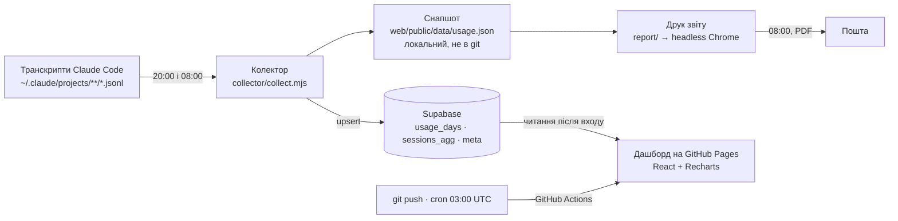

# spend-lens — опис проєкту та політики оновлення

Аналітика витрат і токенів Claude Code: **куди йдуть гроші — і що з цим робити**.

Дашборд: <https://nevsky-bi-user.github.io/spend-lens/> · Репозиторій: `Nevsky-BI-user/spend-lens` · Локально: `C:\github\spend-lens`

Документ описує, з чого складається система, звідки береться кожне число і — головне — **що, коли і за яким розкладом оновлюється**. Технічна специфікація розробки живе окремо у [CONTRACT.md](CONTRACT.md); тут — картина цілком.

---

## 1. Навіщо це

Claude Code пише транскрипт кожної сесії у `%USERPROFILE%\.claude\projects\**\*.jsonl`. Там є все: модель, токени, кеш, час, проєкт — але у форматі, непридатному для читання людиною (близько 1 900 файлів, ~1,4 ГБ). spend-lens перетворює це на відповідь за 30 секунд перегляду:

1. **Скільки** витрачено — сьогодні, за тиждень, місяць, разом.
2. **Де саме** — за проєктами, моделями, сесіями, основні проти субагентів.
3. **Чому дорого** — пʼять факторів перевитрати з оцінкою втрат у доларах.
4. **Що зробити** — готовий український промпт під кожну проблему з кнопкою «Копіювати»: вставили в Claude Code — і він розбирається з причиною.

Цикл, заради якого все будувалося: *глянув → побачив проблему → скопіював промпт → віддав Клоду*.

---

## 2. Як влаштовано



Ключова ідея: **сирі дані не залишають ваш компʼютер**. Колектор рахує агрегати локально, у хмару йдуть лише суми за днями та сесіями — жодних текстів переписки.

---

## 3. Компоненти

### 3.1 Колектор — `collector/`

Потоковий парсер без жодної npm-залежності (`node:fs`, `readline`, `https`).

| Що робить | Деталі |
|---|---|
| Читає транскрипти | Кеш `collector/.cache/files.json` за шляхом, розміром і часом зміни — повторний прохід ~2 с замість ~8 с |
| Дедуплікує | Одна відповідь API пишеться в лог кілька разів. Ключ — `message.id`, лишається останній запис. Без цього витрати завищені приблизно вдвічі |
| Рахує вартість | Ціни тягне з LiteLLM, при збої — таблиця `collector/pricing.json`. Кеш-запис на 5 хв коштує 1,25× ціни входу, на 1 год — 2× |
| Розкладає по днях | Часовий пояс **Europe/Kyiv**, не UTC — інакше нічні сесії падають у сусідній день |
| Пише результат | `web/public/data/usage.json` плюс upsert у Supabase |

Запуск вручну: `node collector/collect.mjs` (додайте `--no-push`, щоб не чіпати Supabase).

### 3.2 Дашборд — `web/`

Vite + React + Recharts, світла тема в стилі iOS, уся мова інтерфейсу українська. Пʼять вкладок: **Огляд**, **Категорії**, **Сесії**, **Фактори**, **Дії**. Глобальні фільтри — період (7 днів / 30 днів / увесь час) і проєкт — діють на всі вкладки одразу.

Три режими роботи:

- **Supabase** — так працює опублікований сайт: вхід через Google або код на пошту, дані з бази під RLS.
- **Локальний** — `npm --prefix web run dev`, читає `usage.json` з диска, без авторизації.
- **Демо** — якщо снапшота немає, показує синтетичні дані з банером, щоб інтерфейс не був порожнім.

### 3.3 Бекенд — Supabase

Таблиці: `usage_days` (агрегати день × проєкт × модель), `sessions_agg` (одна сесія — один рядок), `meta` (час збору, застосовані ціни), `allowed_users` (білий список пошт). RLS дозволяє читання лише авторизованому користувачеві з білого списку; записує тільки колектор із сервісним ключем. Налаштування з нуля — [supabase/README.md](supabase/README.md).

### 3.4 Звіти — `report/`

PDF **не мальований окремо** — це надрукований справжній сайт: застосунок має прихований режим `?print=daily|monthly|yearly`, локальний сервер віддає збірку, headless Chrome друкує сторінку в A4. Тому звіт виглядає точно як дашборд і не розʼїжджається з ним при змінах. Далі `nodemailer` шле лист через Gmail SMTP з PDF у вкладенні.

### 3.5 Публікація — GitHub Actions

`.github/workflows/deploy.yml` збирає `web/` і публікує на GitHub Pages.

---

## 4. Дані

**Снапшот** (`usage.json`, `schemaVersion 1`) містить два масиви: `days[]` — грань «день × проєкт × модель × субагент» з токенами й вартістю; `sessions[]` — сесія з назвою, часом, моделями, середнім і максимальним контекстом, кеш-хітом. Плюс `pricingUsed` (застосовані ціни) і `warnings`.

Стан на 19 серпня 2026: **52 дні** (18.06–19.08), 357 рядків днів, 1 762 сесії, разом **$9 779**, ціни з LiteLLM.

**Що не потрапляє нікуди**: тексти повідомлень, вміст файлів, промпти. Назви сесій — так, бо без них сесію не впізнати.

---

## 5. Логіка аналітики

Аналітика рахується **на клієнті** з готового снапшота — тому пороги можна змінювати без перезбирання даних (`web/src/lib/rules.js`).

| Прапорець | Коли спрацьовує | Що означає |
|---|---|---|
| Кеш-промахи | кеш-хіт < 60 % і сесія дорожча за $1 | Контекст перечитується замість кешу — щось його інвалідовує (хуки, часті рестарти) |
| Роздутий контекст | середній контекст > 120k токенів | Кожен хід тягне баласт, не потрібний для задачі |
| Дорога модель | надбавка проти sonnet > $3 | Механічну роботу виконує преміум-модель |
| Наддовга сесія | > 300 ходів асистента | Сесія не чиститься, контекст накопичується |
| Субагенти | > 50 % витрат проєкту і > $2 | Багатоагентні збірки там, де вистачило б одного проходу |
| Найдорожча сесія | вартість вище 90-го процентиля | Кандидат на розбір першим |

**Бази порівняння в KPI різні за задумом.** «Сьогодні» порівнюється із **середнім активним днем за весь час** — днем, коли робота була; дні без споживання у знаменник не входять. Учорашній день як база нічого не каже: якщо вчора не працювали, будь-яка сьогоднішня робота дає нескінченний приріст, а після важкого вчора нормальний день виглядає провалом. Сам день порівняння з бази виключено, щоб він не тягнув середнє на себе. Решта вікон (7 і 30 днів) порівнюються з попереднім вікном такої ж довжини. Те саме правило діє у щоденному PDF.

Вкладка **Фактори** підсумовує оцінені втрати за кожним фактором (Парето), вкладка **Дії** перетворює їх на картки з готовими промптами, відсортовані за грошима.

Оцінка втрат — **евристика, а не рахунок**: вона показує порядок величини й пріоритет, а не суму, яку ви гарантовано повернете.

---

## 6. Політики оновлення

### 6.1 Розклад

| Що | Коли | Чим запускається | Результат |
|---|---|---|---|
| Збір даних + Supabase | **щодня 20:00** | Планувальник Windows (принципал S4U — без входу в систему, без десктопу), завдання `spend-lens-daily` → `scripts/run-collector.ps1` | Свіжий `usage.json`, оновлена база — дашборд показує новий день |
| Щоденний звіт | **щодня 08:00** | Завдання `spend-lens-report` → `scripts/run-report.ps1` | Збір даних → PDF **за попередню добу** → лист на пошту |
| Місячний звіт | **1-го числа, 08:00** | те саме завдання (перевіряє дату) | PDF за попередній місяць |
| Річний звіт | **1 січня, 08:00** | те саме завдання | PDF за попередній рік |
| Перепублікація сайту | **щодня 03:00 UTC** і на кожен `git push` у `main` | GitHub Actions | Оновлена збірка на GitHub Pages |

Ранкове завдання спершу **саме збирає дані**, тому звіт о 8:00 бачить і вечірню роботу, яка не потрапила у збір о 20:00.

### 6.2 Оновлення на вимогу

Розклад покриває звичайний ритм, але серед дня дані застарівають. Для цього є два кроки:

1. **Зібрати свіжі дані** — подвійний клік на `scripts\refresh.vbs` (можна винести ярлик на робочий стіл). Скрипт перечитує транскрипти, оновлює снапшот, заливає агрегати в Supabase і синхронізує копію для локального перегляду. **Вікно не зʼявляється** — збір іде прихованим процесом; що він відпрацював, видно за віком даних у шапці дашборда, а подробиці — у `collector\.cache\last-run.log`. Якщо збір впаде, зʼявиться діалог із кодом помилки й шляхом до логу, який сам закриється через хвилину (модальне вікно без таймаута підвісило б неінтерактивний запуск). Звітний конвеєр запускається так само: ярлик на `wscript.exe "<репо>\scripts\refresh.vbs" report`. Те саме без файлу: `schtasks /Run /TN spend-lens-daily`. Старий `scripts\refresh.cmd` лишився тільки заради наявних ярликів: він мовчки передає роботу `refresh.vbs` і одразу завершується — подвійний клік по `.cmd` неминуче блимає консоллю, тому нові ярлики ведуть на `.vbs`.
2. **Перечитати їх у дашборді** — кнопка **«Оновити»** в шапці. Вона не перезавантажує сторінку: вкладка, фільтри й прокрутка лишаються на місці.

Поруч із часом збору показано вік даних («щойно», «6 годин тому»). Якщо дані старші за 3 години, кнопка підсвічується помаранчевим. Повернення на вкладку після паузи автоматично перечитує дані, якщо вони старші за 10 хвилин.

Важливо розуміти розподіл ролей: кнопка в дашборді **читає** джерело (Supabase або локальний файл), а **збирає** дані лише колектор на вашій машині. Тому з телефона кнопка покаже те, що востаннє залив колектор.

### 6.3 Умови запуску — важливо

Обидва завдання створюються з налаштуваннями, без яких Windows тихо їх пропускає:

- **дозволено на живленні від батареї** і не спиняти при переході на батарею;
- **наздогнати пропущений запуск** — якщо компʼютер спав о 8:00, завдання відпрацює одразу після пробудження;
- до 3 повторів з інтервалом 10 хвилин, обмеження виконання — 1 година.

> Історична примітка: 19.08.2026 ранковий звіт не вийшов саме через це. `schtasks` за замовчуванням створює завдання з умовою «лише від мережі», і Планувальник відмовив із кодом `0x800710E0`. Скрипти реєстрації виправлено, налаштування застосовано до наявних завдань.

### 6.4 Де дивитися, чи все відпрацювало

```bash
schtasks /Query /TN spend-lens-report /V /FO LIST
```

- Лог збору: `collector/.cache/last-run.log`
- Лог ранкового звіту: `collector/.cache/report-run.log`
- Готові PDF: `report/out/`
- Підпис «Дані оновлено: …» у шапці кожного PDF і на дашборді
- Успішний запуск — `Last Result: 0`. Код `0x800710E0` означає умови запуску, `0x1` — дивіться лог

### 6.5 Оновлення самого коду

Гілка `main` — єдина. Кожен `git push` автоматично перезбирає й публікує сайт (2–3 хвилини). Зміни в `web/src/**` автоматично потрапляють і в PDF, бо звіт друкує той самий сайт; після правок інтерфейсу варто прогнати `node report/report.mjs --type daily --no-send` і переконатися, що звіт не поїхав.

### 6.6 Ціни моделей

Тягнуться з LiteLLM при кожному зборі, кеш — `collector/.cache/litellm.json`. Якщо мережа недоступна, застосовується таблиця `collector/pricing.json`, а у снапшоті зʼявляється позначка `pricingSource: fallback`. Цю таблицю варто звіряти з реальними цінами раз на квартал.

### 6.7 Жодного самочинного термінала

**Ніщо в проєкті не відкриває термінал за власною ініціативою.** Ані за розкладом, ані по кліку: усе фонове виконується прихованим процесом. Виняток один — **явна вказівка користувача**: команда, яку він сам набрав у вже відкритій оболонці, або вікно, яке він прямо попросив. Правило записане в [CONTRACT.md](CONTRACT.md) («Process launch policy») і зобовʼязує однаково людину й агента.

- Обидва завдання Планувальника реєструються через `Register-ScheduledTask` із принципалом **S4U**: завдання виконується без входу в систему, у сесії без десктопу — вікна не існує в принципі. Раніше вони створювалися через `schtasks /Create` без `/RU /RP /NP`, а це `LogonType=InteractiveToken`: завдання щоразу працювало в сесії з десктопом, і `-WindowStyle Hidden` ховав вікно вже після того, як його намалював conhost. Саме звідси було блимання о 20:00 і 08:00.
- Оновлення на вимогу — `scripts\refresh.vbs` через `wscript.exe` (не консольний хост), стиль вікна `0`; аргумент `report` запускає звітний конвеєр так само беззвіконно.
- Усі дочірні процеси Node запускаються з `windowsHide: true`, браузер для PDF — з `--headless=new` (`windowsHide` ховає консоль, але не GUI-вікно браузера).
- В операційних скриптах немає `pause`, `Read-Host`, `timeout` і модального `MsgBox`: у прихованому запуску читати нікому, а діалог у неінтерактивній сесії малюється на невидимій віконній станції — його ніхто не закриє, і завдання висить до ліміту виконання (24.08.2026 саме так лишилися висіти три оболонки — 45 хвилин). Замість `MsgBox` — `Shell.Popup` з таймаутом 60 секунд.
- Замість консолі: логи `collector/.cache/*.log`, підпис «Дані оновлено» у дашборді й PDF, кнопка «Оновити». Помилку, яку не можна проґавити, показує діалог, що сам закривається, — але не термінал.

**Перевіряється автоматично.** `node scripts/window-lint.mjs` — 17 правил по `scripts/`, `collector/`, `report/` і `web/vite.config.js`; той самий лінтер запускає `.github/workflows/window-lint.yml` на кожен push і PR, а `.claude/hooks/no-self-launched-terminal.sh` перехоплює спробу агента ще до запису у файл — і **питає**, а не блокує, бо явна вказівка користувача дозволена. Свідомий виняток позначається маркером `spend-lens:allow-window(<причина>)` у коментарі, а причина описується в CONTRACT.md.

**А що робити, коли вікно все-таки блимнуло.** Лінтер стежить за репозиторієм і
не бачить того, що вже зареєстровано на комп'ютері: завдання, створене старою
версією скрипта, зберігає свій старий принципал, доки його не перереєструють, а
вікно, яке вискакує кожні кілька хвилин, може належати геть сторонній програмі.
Для цього є пара скриптів, і жоден із них не відкриває термінал:

- **Знайти** — подвійний клік на `scripts\tasks.vbs` (або
  `wscript.exe scripts\tasks.vbs`). Аудит **лише читає**: показує, які завдання
  Планувальника взагалі здатні намалювати вікно (принципал із десктопом +
  консольний хост — тільки ця пара дає вікно), які повторюються частіше ніж раз
  на годину, і — з журналу `Microsoft-Windows-TaskScheduler/Operational`, події
  129 і 200 — що реально спрацьовувало останні години та з якою періодичністю.
  Результат: діалог, що сам закривається, і `collector\.cache\task-audit.log`.
  Нічого не вимикає: назвати чуже завдання і видалити його — різні рішення.
- **Полагодити своє** — `wscript.exe scripts\tasks.vbs fix`. Перереєстровує
  `spend-lens-daily` і `spend-lens-report` через виправлені скрипти і записує
  отриманий `LogonType` — це і є доказ, що блимання зникло. Потрібно один раз на
  машину: виправлення коду не змінює вже зареєстроване завдання.

---

## 7. Операції

### Ручні команди

```bash
node collector/collect.mjs
node report/report.mjs --type daily --no-send
node report/report.mjs --type monthly
npm --prefix web run dev
```

Для звіту за конкретну дату — `--date 2026-08-15` (щоденний звіт візьме 14 серпня).

### Змінити розклад

```powershell
powershell -NoProfile -ExecutionPolicy Bypass -File scripts\register-report-task.ps1 -Time 09:30
```

Скрипт реєструє завдання з принципалом S4U; якщо обліковий запис не має права «Log on as a batch job», він скаже про це й зареєструє завдання з інтерактивним токеном (вікно приховане, але можливе коротке блимання).

Вимкнути: `schtasks /Delete /TN spend-lens-report /F`.

### Секрети

`report/.env` (поза git): `REPORT_TO`, `SMTP_USER`, `SMTP_APP_PASSWORD` (пароль застосунку Google), `MONTHLY_BUDGET_USD`. `collector/.env`: `SUPABASE_URL` і сервісний ключ. У репозиторії публікуються лише `VITE_SUPABASE_URL` і `VITE_SUPABASE_ANON_KEY` — це публічні за призначенням значення, захищені політиками RLS. **Сервісний ключ ніколи не залишає компʼютер.**

### Типові збої

| Симптом | Причина | Що робити |
|---|---|---|
| Звіт не прийшов о 8:00 | Компʼютер був вимкнений або умови запуску | Перевірити `Last Result`; при `0x800710E0` перереєструвати завдання |
| Лист не надійшов, PDF є | Немає або застарів пароль застосунку | Оновити `SMTP_APP_PASSWORD` у `report/.env` |
| На сайті старі числа | Збір не відпрацював або кеш браузера | `node collector/collect.mjs`, потім Ctrl+Shift+R |
| «Доступ заборонено» на сайті | Пошта не в білому списку | Додати рядок у таблицю `allowed_users` |
| Google каже `redirect_uri_mismatch` | У Google Cloud не той redirect URI | Має бути `https://<проєкт>.supabase.co/auth/v1/callback` |

---

## 8. Приватність

Репозиторій **публічний**, тому в git не потрапляють: снапшот із реальними даними, `.env`-файли, кеш, готові PDF. У документації використовується `%USERPROFILE%` замість імені користувача, демо-дані синтетичні. Дашборд захищений входом і білим списком пошт; без авторизації на сайті видно лише демо.

---

## 9. Дизайн

Світла тема в стилі iOS: тло `#F2F2F7`, білі картки з радіусом 14, системний шрифт, акценти — синій `#007AFF`, бірюзовий, помаранчевий, фіолетовий, зелений, сірий. Порядок серій на графіках фіксований, щоб колір моделі не стрибав між вкладками. Адаптив: на телефоні таблиця сесій стає списком карток із повноекранними деталями, довгі назви переносяться, тач-цілі — від 44 px.

---

## 10. Історія версій

| Версія | Що додано |
|---|---|
| v1.0 | Колектор, дашборд, Supabase, публікація |
| v1.1 | Глобальні фільтри, сортування сесій, без обрізань назв |
| v1.2 | PDF-зведення на пошту: день, місяць, рік |
| v1.3 | PDF друкується з реального сайту; щоденний звіт о 08:00 за попередню добу |
| v1.4 | Адаптивність під телефон і планшет |
| v1.5 | Розбивка за проєктами, порівняння з минулим місяцем, прогноз |
| v1.6 *(у розробці)* | Провал у день із графіка, бюджет і попередження, аномалії, метрики ефективності, теплокарта, стан фільтрів в URL, експорт XLSX |

---

## 11. Плани

Заміна пошти на Telegram: генератор PDF лишається, замість SMTP — `sendDocument` у Bot API (потрібні токен бота і chat_id у тому ж `report/.env`).
