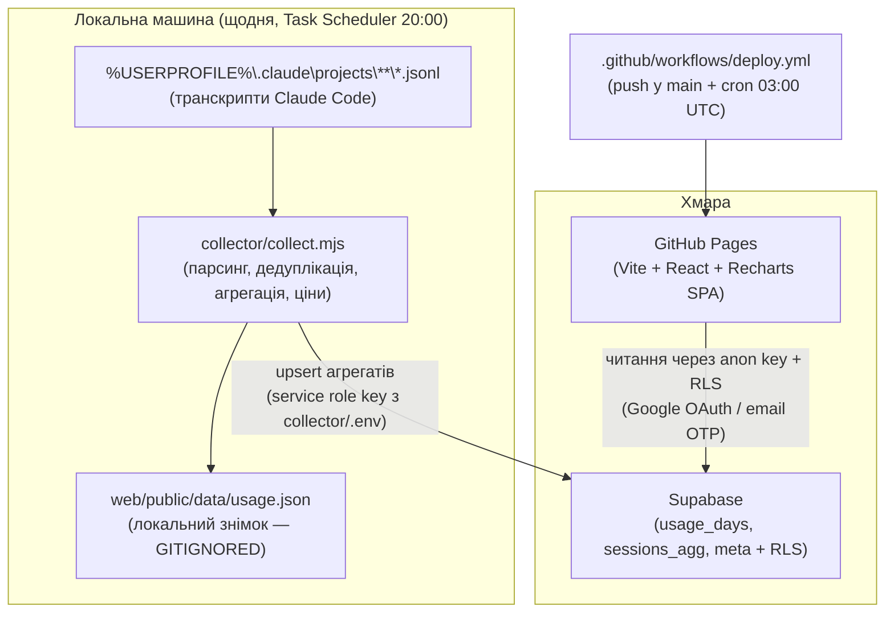

# spend-lens

Аналітичний дашборд витрат і токенів Claude Code. Він відповідає на два питання: **де** саме «горять» гроші (проєкти, моделі, сесії, кеш) і **чому** (роздутий контекст, кеш-промахи, надто дорога модель, наддовгі сесії, субагенти). Для кожної знайденої проблеми дашборд генерує готовий український промпт — його можна одним кліком скопіювати назад у Claude Code, щоб оптимізувати роботу.

## Архітектура



Режими вебзастосунку:

| Режим | Умова | Джерело даних |
|---|---|---|
| **Supabase** | `VITE_SUPABASE_URL` задано під час збірки | таблиці Supabase (потрібен вхід, доступ лише для allow-list) |
| **Локальний** (dev) | немає Supabase, `data/usage.json` існує | локальний знімок колектора |
| **Демо** | `data/usage.json` відсутній або `?demo=1` | `data/demo.json` (синтетичні дані) + банер «Демо-дані» |

## Швидкий старт

Потрібні: Windows, Node.js 24+, npm 11+.

```powershell
git clone https://github.com/Nevsky-BI-user/spend-lens.git
cd spend-lens

# 1. Зібрати локальний знімок даних (читає %USERPROFILE%\.claude\projects)
node collector\collect.mjs

# 2. Запустити дашборд локально
cd web
npm ci
npm run dev
```

Відкрийте адресу, яку покаже Vite. Без `usage.json` застосунок автоматично покаже демо-дані — це нормальний стан «з коробки».

Корисні прапорці колектора:

```powershell
node collector\collect.mjs --verbose          # докладний лог
node collector\collect.mjs --no-push          # без відправлення в Supabase
node collector\collect.mjs --source <dir>     # інша тека з *.jsonl
node collector\collect.mjs --out <file>       # інший файл знімка
```

## Щоденний розклад: два незалежні механізми

Оновлення даних і оновлення сайту навмисно розділені:

1. **Свіжість даних — локальний Task Scheduler (20:00 за місцевим часом).**
   Транскрипти Claude Code існують лише на вашій машині, тому тільки вона може їх зібрати. Заплановане завдання щодня запускає колектор: він оновлює локальний `usage.json` і відправляє агрегати в Supabase.

   ```powershell
   powershell -NoProfile -ExecutionPolicy Bypass -File scripts\register-task.ps1
   ```

   Це створює завдання `spend-lens-daily`, яке щодня о 20:00 виконує `scripts\run-collector.ps1`. Лог останнього запуску: `collector\.cache\last-run.log`. Видалити завдання: `schtasks /Delete /TN "spend-lens-daily" /F`.

2. **Редеплой сайту — GitHub Actions cron (03:00 UTC).**
   Воркфлоу `.github/workflows/deploy.yml` перезбирає і публікує SPA на GitHub Pages: після кожного push у `main`, щодня за розкладом і вручну через *Run workflow*. Щоденний редеплой гарантує, що збірка «підхопить» актуальні змінні середовища, а статичний сайт не застаріває. Самі дані сайт читає із Supabase у рантаймі, тож свіжі цифри з'являються одразу після локального запуску колектора — без редеплою.

Для збірки в режимі Supabase у репозиторії мають бути задані **variables** (не secrets): `VITE_SUPABASE_URL` і `VITE_SUPABASE_ANON_KEY` (*Settings → Secrets and variables → Actions → Variables*). У *Settings → Pages* виберіть джерело **GitHub Actions**.

Операційні кроки — запуск на вимогу, зміна розкладу, перевірка результату, ротація секретів, типові збої — зібрані в [RUNBOOK.md](RUNBOOK.md).

## Налаштування бекенда (Supabase)

Схема таблиць, RLS-політики, allow-list користувачів і налаштування Google OAuth описані в [supabase/README.md](supabase/README.md). Коротко:

1. Створіть проєкт Supabase і застосуйте міграцію `supabase/migrations/001_init.sql`.
2. Скопіюйте `collector/.env.example` у `collector/.env` і заповніть `SUPABASE_URL` та `SUPABASE_SERVICE_ROLE_KEY`.
3. Задайте repo variables `VITE_SUPABASE_URL` і `VITE_SUPABASE_ANON_KEY` для збірки на Pages.

## Приватність

Репозиторій **публічний**, тому:

- **Реальні дані ніколи не комітяться.** `web/public/data/usage.json` (справжні витрати, назви сесій і проєктів) — у `.gitignore`, як і `collector/.cache/` та `collector/.env` із service role key.
- **Демо-дані синтетичні.** `web/public/data/demo.json` містить вигадані проєкти («proj-alpha», «proj-beta»…) і згенеровані числа.
- **Жодних локальних шляхів з іменем користувача** в документації та коді — лише `%USERPROFILE%`.
- **Доступ до реальних даних у хмарі** захищено RLS: читати таблиці може тільки автентифікований користувач з allow-list (`allowed_users`); анонімний ключ без входу не дає нічого.
- Service role key живе лише локально в `collector/.env` і ніколи не потрапляє ні в репозиторій, ні у фронтенд.
- **Жодних особистих ідентифікаторів у файлах під git**: пошт, ключів, ідентифікаторів проєкту Supabase. У документації й міграції — лише заповнювачі (`<your-email@example.com>`, `<project-ref>`); реальні значення підставляються під час налаштування. Хук `.claude/hooks/privacy-guard.sh` блокує `git add -A` / `git add .` і спроби додати приватні файли (правило — [CONTRACT.md](CONTRACT.md) → «Privacy», деталі — [.claude/hooks/README.md](.claude/hooks/README.md)).

## Документи

| Файл | Що в ньому |
|---|---|
| [PROJECT.md](PROJECT.md) | Опис системи: компоненти, дані, логіка аналітики, політики оновлення |
| [RUNBOOK.md](RUNBOOK.md) | Операційна інструкція: запуск на вимогу, розклад, перевірка, секрети, збої |
| [CONTRACT.md](CONTRACT.md) | Технічна специфікація, обовʼязкова для реалізації |
| [supabase/README.md](supabase/README.md) | Первинне налаштування бекенда: Supabase, Google OAuth, ключі, доступ |
| [CLAUDE.md](CLAUDE.md) | Інструкції для агента: запуск процесів, тон спілкування |
